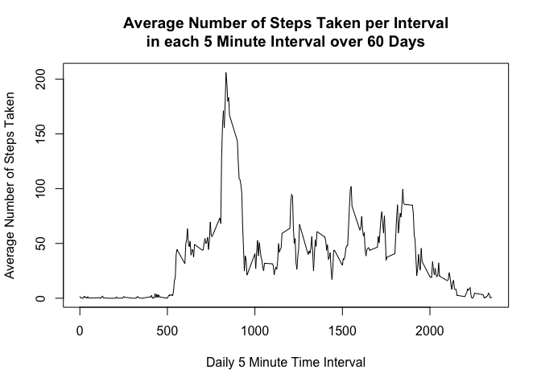
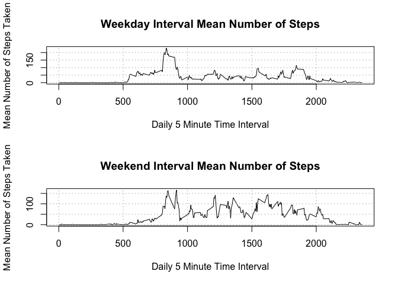

# Reproducable Research Project 1
Investigation of Steps taken over Time
wdsteck  
`r format(Sys.time(), "%d %B, %Y")`  

This analysis looks at data received from a step counter. Every 5 minutes,
the counter records the date, an interval number and the number of steps taken
within that interval.

### Downloading the data
The raw data containing the date, interval numbers and the number of steps
is downloaded from the web from this location:
```
https://d396qusza40orc.cloudfront.net/repdata%2Fdata%2Factivity.zip
```

Project questions will be answered based on this data.


```r
dataFileURL <- "https://d396qusza40orc.cloudfront.net/repdata%2Fdata%2Factivity.zip"
dataFileZip <- "proj1.download.zip"
dataFile <- "activity.csv"

if (!file.exists(dataFile)) {
        if (!file.exists(dataFileZip)) {
                print("Downloading Data Zip File")
                if (download.file(dataFileURL, dataFileZip)) {
                        stop(paste("Could not download data file <",
                                   dataFileURL, "> to zip file <",
                                   dataFileZip, ">", sep = ""))
                }
        }
        print("Unzipping Data Source Files")
        unzip(dataFileZip)
        if (!file.exists(dataFile)) {
                stop(paste("Could not unzip data zip file <", dataFileZip,
                           "> to data files <", dataFile, ">.", sep = ""))
        }
        print("Data Files Successfully downloaded.")
}

df <- read.csv(dataFile, stringsAsFactors = FALSE)
df$date <- as.Date(df$date)
```

Now that the data is loaded, we can look at the data in more detail and start
answering the questions.

### The Number of Steps Taken Each Day
The first 3 steps look at the number of steps taken each day.

**Step 1: Calculate the total number of steps taken per day**


```r
# Find the number of steps taken per day ignoring NAs
spd <- aggregate(steps ~ date, df, FUN = sum, na.action = na.omit)
```

**Step 2: If you do not understand the difference between a histogram
and a barplot, research the difference between them. Make a histogram
of the total number of steps taken each day.**

A histogram plots the number of times a single variable occurs in the data
while a barplot plots the one variable in relation to another and shows the
magnitude of that variable with a vertical or horizontal bar.

This step is looking for a histogram of the number of steps taken each day.
This will show a graph of how many times each sum appears in the data.


```r
hist(spd$steps,
     breaks = 20,
     main = "Frequency of Daily Step Counts",
     xlab = "Daily Step Count"
     )
grid(col = "dark grey")
```

<!-- -->

**Step 3: Calculate and report the mean and median of the total number of steps taken per day**


```r
meanSteps <- mean(spd$steps)
medianSteps <- median(spd$steps)
print(meanSteps)
```

```
## [1] 10766.19
```

```r
print(medianSteps)
```

```
## [1] 10765
```
The mean number of steps taken each day is
about 10766.19 and the median number
of steps taken each day is 10765.

### Average Daily Activity Pattern

**Step 1: Make a time series plot (i.e. `type = "l"`) of the 5-minute
interval (x-axis) and the average number of steps taken,
averaged across all days (y-axis)**

To do this, must first calculate the mean steps per interval:


```r
mspi <- aggregate(steps ~ interval, df, FUN = mean, na.action = na.omit)
```

Then we can plot a line showing the mean steps for each interval over all
the intervals of the day.


```r
plot(mspi, type = "l",
     xlab = "Daily 5 Minute Time Interval",
     ylab = "Average Number of Steps Taken",
     main = "Average Number of Steps Taken per Interval\nin each 5 Minute Interval over 60 Days"
)
```

<!-- -->

**Step 2: Which 5-minute interval, on average across all the days in the dataset, contains the maximum number of steps?**

In the previous step, we calculated the mean steps per invterval (`mspi`).
From that matrix, we can find the interval with the largext mean number
of steps.


```r
maxInterval <- mspi[mspi$steps == max(mspi$steps),]$interval
maxSteps <- mspi[mspi$steps == max(mspi$steps),]$steps
print(paste("On average, interval",
            maxInterval,
            "has the largest, average number of steps at",
            format(maxSteps)
            )
      )
```

```
## [1] "On average, interval 835 has the largest, average number of steps at 206.1698"
```
Interval 835 has the largest mean number of steps of any interval
at 206.17.

###Imputing missing values

**Step 1: Calculate and report the total number of missing values in the dataset (i.e. the total number of rows with 𝙽𝙰s)**

To calculate the number of missing values, we simply add up all the NAs
in the data set.

```r
missingValues <- sum(is.na(df$steps))
print(paste("There are", missingValues, "missing values in the Data Set."))
```

```
## [1] "There are 2304 missing values in the Data Set."
```
There are 2304 missing values in the data set. This is
13.11% of the data set.
For some calculations, this could introduce a significant error.

**Step 2: Devise a strategy for filling in all of the missing values in the dataset. The strategy does not need to be sophisticated. For example, you could use the mean/median for that day, or the mean for that 5-minute interval, etc.**

There are many different strategies that could be used to impute the missing
values. We could use the average for the day, but since we are also averaging
across each interval, this could introduce a lot of error, and if one complete
day's worth of data is missing, the day's average would not provide any value
to introduce.

I chose to impute the NA values by replacing these missing values with
the average for that interval
across all the days. Since there are a lot of intervals
in a day, errors in this strategy should not adversely
impact the daily averages, and the interval averages will not
be impacted at all by adding additional average values into that mean.

The impute strategy could be taken 1 step further by creating a weekend mean and
a weekday mean for each interval and then replacing the NA values
with the appropriate mean based on the day of the week of the missing NA.
We could even go further by calculating a "day of the week" mean for each interval
and then replacing the missing values by the appropriate interval mean based on
the day of the week of the missing value. For the purposes of this assignment,
I don't think that additional complexity will provide further insight into
the data.

**Step 3: Create a new dataset that is equal to the original dataset but with the missing data filled in.**

So to implement the chosen strategy, I will add an additional column to the data
frame that will hold the number of steps where the NA values have been replaced
by the mean of the interval of the missing values. To do this, I will use a simple
`ifelse` statement.


```r
df$stepsNoNA <- ifelse(is.na(df$steps), mspi$steps[match(df$interval, mspi$interval)], df$steps)
```

**Step 4: Make a histogram of the total number of steps taken each day and Calculate and report the mean and median total number of steps taken per day. Do these values differ from the estimates from the first part of the assignment? What is the impact of imputing missing data on the estimates of the total daily number of steps?**

To make a histogram of the number of steps taken each day, create
a new structure holding the number of steps taken each day and plot it.

```r
spdNoNA <- aggregate(stepsNoNA ~ date, df, FUN = sum)
hist(spdNoNA$stepsNoNA,
     breaks = 20,
     main = "Frequency of Daily Step Counts with Missing Data\nReplaced with Mean for that Interval",
     xlab = "Daily Step Count"
)
grid(col = "dark grey")
```

<!-- -->

```r
print(paste("Mean of steps per day (with NA replacement): ", mean(spdNoNA$stepsNoNA)))
```

```
## [1] "Mean of steps per day (with NA replacement):  10766.1886792453"
```

```r
print(paste("Median of steps (with NA replacement): ", median(spdNoNA$stepsNoNA)))
```

```
## [1] "Median of steps (with NA replacement):  10766.1886792453"
```
The only difference between this histogram and the histogram without the imputed
NA values is the 10000 section (the section containing the daily step mean) has
increased by 8 ticks. All the other bar heights remained the same.

This happens because
of the data. The data read in from the data file contains some missing values
in intervals in 8 different days. Interestingly, every interval is missing in each
of those 8 days, so the result of applying the impute strategy I did is that the
mean number of steps taken per day for those missing days equals the mean steps taken
over all the other days. The median becomes this value since the result of
applying the impute strategy adds 8 days of mean steps per day values in the middle
of the means so the median was very likely going to land on one of those 8 means.

Given the distribution of the NA values, the mean and median with and without
the NA values are not that different.

###Are there differences in activity patterns between weekdays and weekends?

**Step 1: Create a new factor variable in the dataset with two levels – “weekday”
and “weekend” indicating whether a given date is a weekday or weekend day.**


```r
df$daytype <- ifelse(weekdays(df$date) %in% c("Saturday", "Sunday"), "Weekend", "Weekday")
```

**Step 2: Make a panel plot containing a time series plot (i.e. 𝚝𝚢𝚙𝚎 = "𝚕") of 
the 5-minute interval (x-axis) and the average number of steps taken, averaged across 
all weekday days or weekend days (y-axis). See the README file in the GitHub 
repository to see an example of what this plot should look like using simulated 
data.**


```r
par(mfrow = c(2,1))
mspiNoNAwd <- aggregate(stepsNoNA ~ interval, df[df$daytype == "Weekday",], FUN = mean, na.action = na.omit)
plot(mspiNoNAwd,
     type = "l",
     xlab = "Daily 5 Minute Time Interval",
     ylab = "Mean Number of Steps Taken",
     main = "Weekday Interval Mean Number of Steps"
)
grid(col = "dark grey")

mspiNoNAwe <- aggregate(stepsNoNA ~ interval, df[df$daytype == "Weekend",], FUN = mean, na.action = na.omit)
plot(mspiNoNAwe,
     type = "l",
     xlab = "Daily 5 Minute Time Interval",
     ylab = "Mean Number of Steps Taken",
     main = "Weekend Interval Mean Number of Steps"
)
grid(col = "dark grey")
```

<!-- -->
